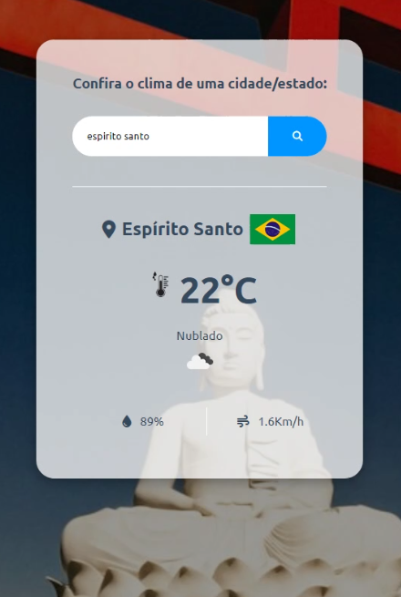

# Weather API Application

## Description

This application provides real-time weather information around the world. It displays essential data like temperature, humidity, wind speed, and weather conditions.  The app also features a dynamic background image that changes based on the location, along with the corresponding country flag.

  

## Usage

1. Enter the location name in the search field. Examples:
   * "Espirito Santo"
   * "Santa Catarina"  
2. Click the search button or press Enter.

## Technologies Used

* HTML
* CSS
* JavaScript
* OpenWeatherMap API (https://openweathermap.org/) for weather data
* Unsplash API (https://unsplash.com/) for fetching background images
* Flags API (https://flagsapi.com/) for fetching country flags

## Installation

1. Clone this repository.
2. **Obtain API keys** for OpenWeatherMap, Unsplash, and Flags API.
3. **Insert your API keys** into the corresponding variables within the JavaScript code.
4. Open `index.html` in your web browser.

## Credits

* Weather data: [OpenWeatherMap API](https://openweathermap.org/)
* Images: [Unsplash](https://unsplash.com/)
* Flags: [Flags API](https://flagsapi.com/)

